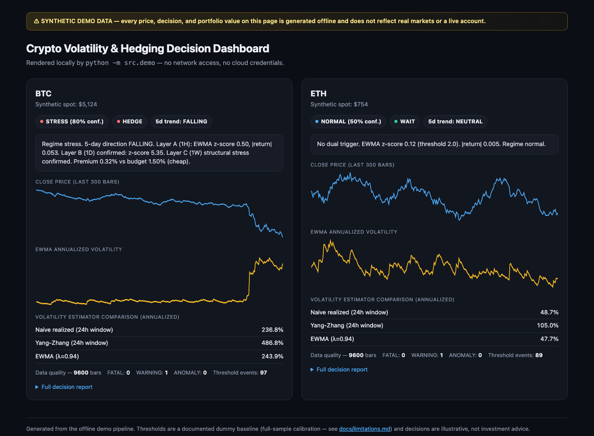
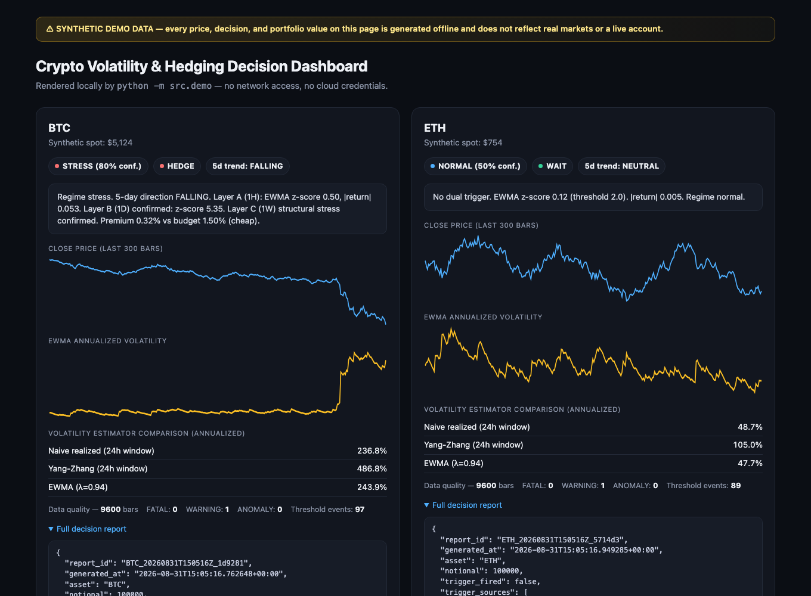
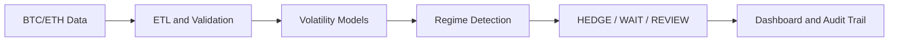

# Crypto Volatility & Hedging Decision System

An end-to-end crypto volatility and hedging decision system that validates BTC/ETH market data,
compares multiple volatility estimators, detects changing risk regimes, and translates statistical
signals into explainable **HEDGE / WAIT / REVIEW** decisions — runnable entirely offline against
deterministic synthetic data.

```bash
git clone <this-repo>
cd crypto-volatility-hedging-system
python3 -m venv .venv && source .venv/bin/activate
pip install -e ".[dev,api]"
python -m scripts.generate_sample_data
python -m src.demo
open dashboard.html
```

---

## 1. Project summary

BTC and ETH hourly OHLCV data flows through five stages — ingestion, data-quality validation,
three independent volatility estimators, a documented stress-threshold system, and a regime
classifier — into a deterministic decision engine that outputs one of three actions: **HEDGE**,
**WAIT**, or **REVIEW**, each with a human-readable rationale, a scenario analysis, and a
persistent per-asset audit trail (anti-whipsaw suppression, sticky REVIEW state, kill switch).

Every claim in this README is one of four kinds — statistical validation, offline synthetic
demonstration, historical analysis, or deployable architecture — and they are never conflated.
See [`docs/validation.md`](docs/validation.md) for exactly which is which, and
[`docs/limitations.md`](docs/limitations.md) for what is explicitly **not** established.

## 2. Business problem

A crypto portfolio manager needs to know two things in a fast-moving market: *has the risk regime
actually changed*, and *if so, what — concretely — should be done about it, and why*. A single
volatility number is not enough — different estimators disagree by design (see Section 7), and a
naive "volatility is high, hedge now" rule whipsaws a book in and out of positions on noise. This
system's job is to turn multiple disagreeing volatility signals into one explainable,
audit-logged decision, with the disagreement itself surfaced rather than hidden.

## 3. My ownership and contribution

I designed and implemented every layer in this repository: the causal (no-lookahead) volatility
estimators, the OHLC integrity validator, the deterministic decision engine (kill switch, sticky
REVIEW, anti-whipsaw), the per-asset state store, the offline synthetic-data generator, the
FastAPI service, the dashboard, and the full test suite. This is a curated extract of a larger
private system — see [`docs/architecture.md`](docs/architecture.md) for exactly which pieces were
included and how they map to the production version.

## 4. Dashboard

`python -m src.demo` renders a self-contained `dashboard.html` — no server, no build step, open
it directly in a browser.


*Overview: side-by-side BTC/ETH cards showing price and EWMA-volatility sparklines, the current
regime and decision badges, and the volatility-estimator comparison table. BTC is inside a
synthetic tail-shock here, so its decision is HEDGE; ETH is calm and WAITs — the two are
deliberately different so the dashboard demonstrates both outcomes in one run.*


*Detail: the "Full decision report" panel expanded, showing the deterministic scenario analysis
(portfolio loss vs. option payout at −5%/−10%/−20%/−30%) and the exact rationale string the
decision engine produced.*

All prices, decisions, and portfolio values shown are **synthetic** — see the banner on the
dashboard itself and [`docs/limitations.md`](docs/limitations.md).

## 5. Architecture and data flow



Full module-by-module breakdown, including exactly what changes between this offline build and a
deployed version: [`docs/architecture.md`](docs/architecture.md).

## 6. Data ingestion and quality validation

`src/ingestion/loader.py` normalizes a CSV into the canonical OHLCV schema (in a deployed build
this is a BigQuery query instead — same downstream interface, see `docs/architecture.md`).

Before any volatility math runs, `src/validation/integrity.py` audits the data against a
three-tier severity taxonomy:

- **FATAL** — structurally impossible bars (`high < low`, non-positive prices, nulls). Consumers
  must not run on FATAL data.
- **WARNING** — suspicious but not corrupt (zero volume, a 10×+ volume spike vs. the rolling
  median).
- **MARKET_ANOMALY** — technically valid but statistically abnormal (a stale/frozen feed, a flat
  streak).

This isn't decorative: the synthetic demo data's injected panic-volume during shock windows
actually trips the WARNING-VOLUME-SPIKE check on every run — see it live in the dashboard's "Data
quality" row.

## 7. Volatility estimators and their trade-offs

Three estimators, one shared output schema (`src/volatility/`), so they can be compared
apples-to-apples:

| Estimator | Uses | Strength | Weakness |
|---|---|---|---|
| **Naive realized** (rolling std of close-to-close returns) | Close only | Simplest, most auditable, no OHLC dependency | Blind to intrabar range; hard-cliff artifact when an old spike exits the window |
| **Yang-Zhang** | Open, High, Low, Close | Drift-independent, captures intrabar range explosions the other two miss | Sensitive to bad/thin-book OHLC ticks; requires all four prices |
| **EWMA** (λ=0.94, RiskMetrics) | Close only | Reacts fastest to sudden single-bar shocks; no hard cliff | Never fully mean-reverts; ~12h half-life at λ=0.94 under-weights slow-burn deterioration |

These aren't three ways of computing the same number — real historical backtesting (summarized
honestly, with the surprising results, in [`docs/validation.md`](docs/validation.md) Section 2)
found EWMA was **22 hours late** detecting the FTX collapse specifically because it unfolded as a
slow drift rather than a single shock, while Naive and Yang-Zhang both caught it within ±1 hour.
No single estimator dominates; that's why all three are computed and shown side by side.

**No-lookahead is enforced, not assumed** — every estimator is tested by perturbing only the last
bar of a series and asserting every earlier output is unchanged
(`tests/test_volatility_estimators.py::test_no_lookahead_bias`). See
[`docs/model-rebuild.md`](docs/model-rebuild.md) for why this specific property was made a
first-class test.

## 8. Threshold and regime methodology

`src/thresholds/` implements a **documented dummy baseline**: multi-horizon (1H/24H/168H) stress
flags calibrated on the *full* provided sample, which is intentional full-sample lookahead bias —
the module docstrings say so explicitly, and so does
[`docs/limitations.md`](docs/limitations.md). It exists for infrastructure testing, event
alignment, and cross-model comparison, not as a production-ready trigger.

Regime classification (`src/regime/risk_checks.py::detect_market_regime`) compares recent vs.
overall volatility, skewness, and kurtosis to label each snapshot `stress` / `high_vol` /
`normal` / `low_vol`, on a trailing window sized to the data provided — this is the classifier
`src/decision/signal_aggregator.py` actually gates the HEDGE/WAIT decision on.

## 9. Decision logic

`src/decision/engine.py::decide()` is a pure function — no I/O, same inputs always produce the
same output — evaluated in strict priority order:

1. **Kill switch active** → REVIEW (always wins)
2. **Sticky REVIEW state active** → REVIEW (persists until manually cleared)
3. Policy layer emitted REVIEW (low confidence, missing data, or no pricing) → REVIEW
4. Policy layer emitted WAIT (no dual trigger, or regime not stress) → WAIT
5. **Anti-whipsaw**: a HEDGE within the last 6 hours at a regime that hasn't escalated → WAIT
6. Already fully hedged at the same instrument (ratio ≥ 90%) → WAIT
7. PARTIAL_HEDGE from the policy layer → simplified to HEDGE (with the ratio noted in the rationale)
8. HEDGE

Every decision is persisted per-asset (`src/decision/store.py`) with an append-only approval log
and REVIEW-clearance log — BTC and ETH intentionally do **not** share state, so one asset's
anti-whipsaw window can never suppress the other's hedge (see `docs/architecture.md` for the bug
this fixed). Covered by `tests/test_engine.py` and `tests/test_store.py`.

## 10. Option-pricing component

`src/pricing/option_pricer.py` is a dependency-free Black-Scholes put pricer (stdlib `math` only)
that selects the best-fit instrument for a target delta/expiry and, when the premium is
classified "expensive," proposes a debit put-spread alternative. For the offline demo,
`src/pricing/synthetic_quotes.py` generates a small OTM put chain priced with the same
Black-Scholes primitives — clearly synthetic, not a live order book (see
[`docs/limitations.md`](docs/limitations.md)).

`src/decision/exit_rules.py` complements this on the exit side: given an *already open* hedge, a
six-rule state machine (profit-taking tiers within 72h, a post-spike trailing stop, a
convexity-spent monetize/roll rule, and a hard time cap) decides whether to trim, exit, or hold —
exposed via `POST /decision/exit-check`. The entry-side decision engine only ever answers "should
we open a hedge now"; this was the missing "now that we have one, when do we take it off" half.

## 11. Testing and security controls

- **145 tests**, actually run as part of producing this README — see Section 12.
- `ruff check` and `ruff format --check` both pass clean.
- `detect-secrets` baseline included (`.secrets.baseline`); CI re-scans every push and fails on
  any new, un-audited finding.
- `.pre-commit-config.yaml` wires trailing-whitespace/EOF/merge-conflict hygiene, ruff, and
  detect-secrets together for local use.
- No secrets, real GCP project IDs, live endpoints, or personal filesystem paths anywhere in this
  repository — verified by both automated scanning and manual grep (see
  [`docs/validation.md`](docs/validation.md) for what "verified" means here).

## 12. Selected verified results

Ran on this exact checkout, in this order, right before writing this section:

```
$ ruff check .
All checks passed!

$ ruff format --check .
59 files already formatted

$ pytest -q
145 passed in ~3s

$ python -m scripts.generate_sample_data
[generate_sample_data] BTC: 9600 hourly bars -> data/sample/btc_hourly.csv
[generate_sample_data] ETH: 9600 hourly bars -> data/sample/eth_hourly.csv

$ python -m src.demo
[BTC] integrity: fatal=0 warning=1 market_anomaly=0
[decision] BTC | action=HEDGE | regime=stress | confidence=0.80 | policy=HEDGE
[ETH] integrity: fatal=0 warning=1 market_anomaly=0
[decision] ETH | action=WAIT | regime=normal | confidence=0.50 | policy=WAIT
```

These are pipeline-correctness results (does the code run, produce the right *shape* of
explainable output, on synthetic data) — not a claim about real trading performance. For real
historical estimator behavior on ~72,000 hourly bars of actual BTC/ETH data (2018–2026) across 10
known stress events, see [`docs/validation.md`](docs/validation.md) Section 2.

## 13. Technology stack

Python ≥3.11 · pandas · numpy · scipy · FastAPI + uvicorn (optional `api` extra) · pytest · ruff ·
detect-secrets. No cloud SDKs, no LLM API clients, and no exchange connection libraries are
required to install or run the offline demo.

## 14. Repository structure

```
crypto-volatility-hedging-system/
├── README.md
├── pyproject.toml
├── .env.example
├── .pre-commit-config.yaml
├── .secrets.baseline
├── .github/workflows/ci.yml
├── src/
│   ├── ingestion/       # CSV -> canonical OHLCV schema
│   ├── validation/      # structural + FATAL/WARNING/MARKET_ANOMALY checks
│   ├── volatility/      # naive, yang_zhang, ewma estimators
│   ├── thresholds/      # dummy-baseline multi-horizon stress detection
│   ├── regime/          # detect_market_regime()
│   ├── decision/        # signal aggregation, policy, decision engine, store
│   ├── pricing/         # Black-Scholes pricer + synthetic option chain
│   ├── api/             # FastAPI service
│   └── demo.py          # end-to-end offline orchestrator
├── sql/                 # BigQuery DDL (placeholders only, never executed here)
├── tests/                # 145 tests
├── data/sample/          # generated synthetic OHLCV (gitignored contents optional)
├── docs/
│   ├── architecture.md
│   ├── validation.md
│   ├── model-rebuild.md
│   └── limitations.md
├── assets/               # dashboard template + screenshots
└── scripts/generate_sample_data.py
```

## 15. Offline demo

Requires **no BigQuery credentials, no GCP project, no API key, no network access, no live Cloud
Run service, and no exchange connection.**

```bash
python -m scripts.generate_sample_data   # deterministic synthetic BTC/ETH OHLCV (seeds 42/43)
python -m src.demo                       # validation -> vol models -> thresholds -> regime -> decision
open dashboard.html                      # or: xdg-open dashboard.html on Linux
```

The demo logs `OFFLINE DEMO MODE` explicitly, writes a machine-readable result to
`reports/demo_output.json`, and prints a concise summary. Optional flags: `--input`,
`--eth-input`, `--notional`, `--budget-pct` (`python -m src.demo --help`).

To run the API instead: `uvicorn src.api.main:app --reload`, then `curl -X POST
http://localhost:8000/demo/run`.

## 16. Model-rebuild case study

Before this system, an earlier volatility/regime implementation was deprecated after an audit
found a genuine lookahead-bias bug (a hysteresis rule that rewrote a bar's regime label based on
the *next* bar) plus several other statistical defects. `docs/model-rebuild.md` is that audit,
written up in full — what was wrong, how it was found, what changed in this rebuild, and what
test now specifically prevents the same class of bug from returning.
→ [`docs/model-rebuild.md`](docs/model-rebuild.md)

## 17. Limitations

The threshold system is a documented dummy baseline with intentional full-sample lookahead bias.
No P&L backtest of the decision engine exists anywhere. No proven alpha, no production SLA, no
external usage, and no specific coverage percentage are claimed. Full list, with what a
production-safe threshold system would actually require:
→ [`docs/limitations.md`](docs/limitations.md)

## 18. Next steps

- Replace the dummy-baseline threshold calibration with rolling/expanding-window percentiles
  (eliminates the full-sample lookahead — see `docs/limitations.md` for the exact requirements).
- Recalibrate EWMA λ for hourly data (research suggests 0.97–0.99 vs. the current 0.94, per
  `docs/validation.md`).
- Add an OHLC data-quality pre-filter ahead of Yang-Zhang to suppress thin-orderbook phantom
  wicks, which the historical analysis identified as its dominant false-positive source.
- Wire a real historical dataset through the same pipeline this repo ships, to reproduce
  `docs/validation.md` Section 2 end-to-end rather than summarizing it.
