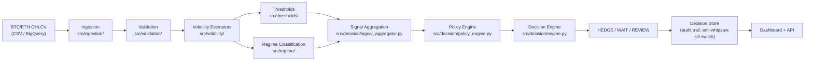

# Architecture

## Data flow



## Module map

```
src/
  ingestion/    load_hourly_csv()          — CSV -> canonical OHLCV schema
                                              (production: BigQuery, see below)
  validation/   schema.py                  — structural OHLCV validation
                                              (used internally by every estimator)
                integrity.py                — FATAL/WARNING/MARKET_ANOMALY data-quality audit
  volatility/   naive.py, yang_zhang.py,    — three volatility estimators, common
                ewma.py                       output schema, all causal (no lookahead)
  thresholds/   derived_returns.py,         — DUMMY BASELINE multi-horizon stress
                threshold_engine.py,          detection (see docs/limitations.md)
                event_windower.py,
                stress_summary.py
  regime/       risk_checks.py              — detect_market_regime(): stress /
                                              high_vol / normal / low_vol classifier
  decision/     signal_aggregator.py        — Layer A(1H)/B(1D)/C(1W) signal state
                directional_signal.py       — 5-day direction overlay (RISING/FALLING/NEUTRAL)
                policy_engine.py            — signal + pricing -> HEDGE/PARTIAL_HEDGE/WAIT/REVIEW
                engine.py                   — pure decide(): kill switch, sticky REVIEW,
                                              anti-whipsaw, PARTIAL_HEDGE simplification
                store.py                   — per-asset JSON state + audit trail
                                              (isolated demo state vs. persistent
                                              operational state — see below)
                runner.py                  — wires engine+policy+report+store together
                report.py                  — deterministic scenario analysis + text report
                exit_rules.py              — spike-exit state machine for an *open*
                                              hedge (profit-tier sells, trailing stop,
                                              convexity-spent roll, time cap)
  pricing/      option_pricer.py           — Black-Scholes pricing, best-fit put selection
                synthetic_quotes.py        — offline put-chain generator (demo only)
  api/          main.py                    — FastAPI: /demo/run, /decision/state,
                                              /decision/kill-switch, /decision/review/clear,
                                              /decision/exit-check
  demo.py       run_symbol_pipeline(), main() — the offline end-to-end orchestrator
```

## Why the decision store is per-asset

`src/decision/store.py` keys its JSON state file by asset
(`decision_state_BTC.json`, `decision_state_ETH.json`). An earlier version of
this demo shared one state file across both assets — the bug and the fix are
documented directly in the module docstring, because it's a real, findable
class of mistake (BTC's anti-whipsaw window would suppress an ETH hedge
recommendation, and the two assets' decision histories would render
interleaved on the dashboard) that's worth naming rather than quietly
patching.

## Isolated demo state vs. persistent operational state

`python -m src.demo` creates a fresh `tempfile.TemporaryDirectory()` for the
decision-layer state of every run and passes it explicitly into
`run_symbol_pipeline(..., state_dir=...)` — it never reads from or writes to
`data/state/` or `DECISION_STATE_DIR`, and the temp directory is removed
automatically when the run finishes. This is a deliberate dependency-injection
seam, not an environment-variable override: `DecisionStore(state_dir=...)`
bypasses the persistent-location resolution entirely when a directory is
passed in.

Two consequences follow directly from this:
- **Determinism.** Two clean `python -m src.demo` runs always produce the
  same canonical result (BTC -> HEDGE, ETH -> WAIT on the shipped synthetic
  fixture), because there is never any state left over from a previous run
  to influence the next one.
- **Non-interference.** Whatever real operational state exists locally (e.g.
  a kill switch set through the API's `/decision/kill-switch`) can never leak
  into a demo run's decision, and a demo run can never mutate it.

The FastAPI `/demo/run` endpoint is the one deliberate exception — it shares
the *persistent* per-asset `DecisionStore` with the other operational
endpoints on purpose, so a kill switch set through the API correctly
suppresses a subsequent `/demo/run` for that asset too (see the module
docstring in `src/api/main.py`). Use the CLI, not the API, when you need
guaranteed determinism.

See `tests/test_demo_state_isolation.py` for the tests proving both
properties, and the "Isolated demo state vs. persistent operational state"
section of `src/decision/store.py`'s module docstring for the implementation
contract.

## What's offline here vs. what a deployed version would add

This repository runs the entire pipeline above with zero network access. A
deployed version — the architecture this code is *shaped* like, not a claim
that it has been operated this way (see `docs/limitations.md`) — would differ
in exactly these places:

| Stage | Offline (this repo) | Deployed |
|---|---|---|
| Ingestion | `load_hourly_csv()` reads `data/sample/*.csv` | BigQuery query against `${PROJECT_ID}.${DATASET}.btc_hourly` / `eth_hourly` |
| Option pricing | `synthetic_quotes.generate_put_chain()` — Black-Scholes-priced synthetic chain | A live options feed (e.g. a Deribit WebSocket client) supplying real `OptionQuote` snapshots to the same `option_pricer.find_target_put()` |
| Decision state | Local JSON files (`data/state/decision_state_{ASSET}.json`) | Same `DecisionStore` interface, pointed at a durable volume via `DECISION_STATE_DIR`, or swapped for a database-backed implementation behind the same read/write methods |
| Audit trail | In-process only, per demo run | Regime snapshots and decision reports also written to BigQuery — see `sql/regime_hourly_history.sql` and `sql/hedge_alerts.sql` for the target schemas |
| Alerting | None (the API returns JSON; nothing is pushed) | A dispatcher reads from an event queue and pushes ACTION_REQUIRED / FATAL alerts to a channel such as Telegram |
| Scheduling | Manual: `python -m src.demo` | An hourly trigger (cron, Cloud Scheduler, etc.) calling the same `run_symbol_pipeline()` / `run_decision()` entry points |

The point of keeping this boundary explicit is that swapping any one row does
not require touching `src/decision/engine.py`, `policy_engine.py`, or the
volatility estimators — they only ever see the same typed interfaces
(`SignalState`, `PricingResult`, `HedgeState`, …) regardless of where the data
came from.

## SQL schemas

`sql/regime_hourly_history.sql` and `sql/hedge_alerts.sql` are the BigQuery
DDL for the two tables `src/decision/signal_aggregator.py` output and
`src/decision/policy_engine.py` decisions would be written to in a deployed
build. Both use `${PROJECT_ID}` / `${DATASET}` placeholders — replace them
with your own values before running; they are never populated by anything in
this repository (there is no BigQuery client code here at all).
